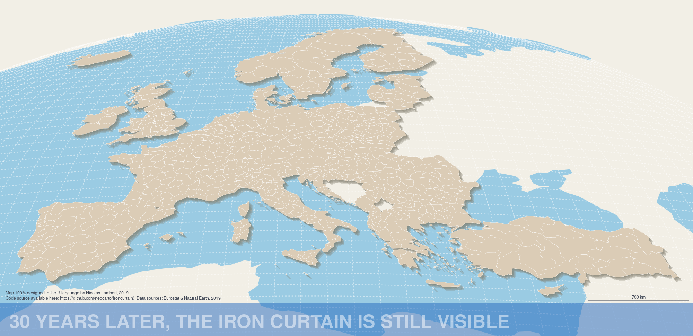
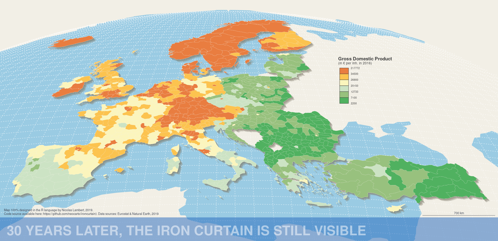

```{r setup, include=FALSE}

## Global options
knitr::opts_chunk$set(echo=TRUE,
        	            cache=FALSE,
                      prompt=FALSE,
                      comment=NA,
                      message=FALSE,
                      warning=FALSE,
                      class.source="bg-info",
                      class.output="bg-warning")
```

# Introduction {-}


Ce document montre comment réaliser cette carte de discontuités en 2,5D (fausse 3D) joliement mise en page entrièrement dans le langage R. Des versions antérieures de cette carte ont déjà été publiées par le passé, dans le manuel de cartographie [@lambert2016manuel], ou dans Mad Maps [@lambert2019mad] et ont fait l'objet de billets de blog [@lambert2019mise]. Ici, nous entendons prouver qu'il est possible de réaliser ce type de carte sans passer par un logiciel DAO [@lambert2019dessiner]. Les sources et les références sont précisées à la fin du document.

```{r, eval = TRUE, message = FALSE, warning = FALSE}
library("sf")
library("mapsf")
library("eurostat")
library("rnaturalearth")
```

# Préparation des données

Pour réaliser cette carte, nous utilisons pour cela les packages *eurostat* [@eurostat], *RnaturalEarth* [@rnaturalearth], *sf* [@sf] et *mapsf* [@mapsf].

## Fond de carte

Avec le package *Eurostat*, nous créons d'un fond de carte hybride avec maillage homogène nuts2/3. Tous les les pays sont au niveau nuts3 version 2016 sauf l'Autriche, la Belgique, la Suisse, l'Allemagne, la Grèce, les Pays-Bas, la Turquie, l'Irlande, l'Islande et la Norvège. Pour des raisons de disponibilité des données post Brexit, Le Royaume-Uni est au niveau nuts2 vesrion 2013. 

```{r, eval = TRUE, message = FALSE, warning = FALSE}
nuts2016 <- get_eurostat_geospatial(
  output_class = "sf",
  resolution = "20",
  nuts_level = "all",
  year = "2016"
)

nuts2016_3 <- nuts2016[nuts2016$LEVL_CODE == 3, ]
nuts2016_2 <- nuts2016[nuts2016$LEVL_CODE == 2, ]

N2 <-
  c("AT", "BE", "CH", "DE", "EL", "NL", "UK", "TR", "IE", "IS", "NO")
nuts <- rbind(nuts2016_2[nuts2016_2$CNTR_CODE %in% N2, ],
              nuts2016_3[!nuts2016_3$CNTR_CODE %in% N2, ])

nuts <- nuts[nuts$CNTR_CODE != "UK", ]

nuts <- nuts[,c("id","NUTS_NAME","geometry")]
colnames(nuts) <- c("id","name","geometry")

nuts2013 <- get_eurostat_geospatial(
  output_class = "sf",
  resolution = "20",
  nuts_level = "2",
  year = "2013"
)

uk = nuts2013[nuts2013$CNTR_CODE == "UK",c("id","NUTS_NAME","geometry")]
colnames(uk) <- c("id","name","geometry")

nuts <- rbind(nuts, uk)


nuts <-
  nuts[!nuts$id %in% c("FRY10", "FRY20", "FRY30", "FRY40", "FRY50"), ]
nuts <- nuts[nuts$id != "RS", ]
```

```{r, eval = TRUE, echo = FALSE, message = FALSE, warning = FALSE, fig.height = 3}
par(mar = c(0, 0, 0, 0), mfrow = c(1, 3))
mf_map(nuts, col = "#CCCCCC", border = NA)
mf_map(nuts[substr(nuts$id,1,2) %in%  c("AT", "BE", "CH", "DE", "EL", "NL", "UK", "TR", "IE", "IS", "NO"),],
       col = "#6eb1db",
       border = "white",
       lwd = 0.2, add = TRUE)
mf_title("NUTS 2 (version 2016)", bg = "#6eb1db")
mf_map(nuts, col = "#CCCCCC", border = NA)
mf_map(nuts[!substr(nuts$id,1,2) %in%  c("AT", "BE", "CH", "DE", "EL", "NL", "UK", "TR", "IE", "IS", "NO", "UK"),],
       col = "#6eb1db",
       border = "white",
       lwd = 0.2, add = TRUE)
mf_title("NUTS 3 (version 2016)", bg = "#6eb1db")
mf_map(nuts, col = "#CCCCCC", border = NA)
mf_map(nuts[substr(nuts$id,1,2) == "UK",],
       col = "#6eb1db",
       border = "white",
       lwd = 0.2, add = TRUE)
mf_title("NUTS 2 (version 2013)", bg = "#6eb1db")
```

## Données statistiques

Import des données statistiques (PIB par habitant en euros zn 2016)

```{r, eval = TRUE, message = FALSE, warning = FALSE}
var <- "nama_10r_3gdp"
gdpinh <- get_eurostat(var, time_format = "num")
gdpinh <- subset(gdpinh, gdpinh$unit == "EUR_HAB")
gdpinh <- reshape2::dcast(gdpinh, geo ~ time, value.var = "values")
fields <- c("geo", "2016")
gdpinh <- gdpinh[, fields]
colnames(gdpinh) <- c("id","GDPINH_2016")
```

A Cause du Brexit, les données pour le Royaume-Uni ne sont plus disponibles. On va les chercher dans dans le fichier missing.csv issu de la [base de données ESPON](https://database.espon.eu/).

```{r, eval = TRUE, message = FALSE, warning = FALSE}
missing <- read.csv("data/missing.csv")
gdpinh = rbind(gdpinh, missing)
```

Pour des questions de reproductibilité, nous sauvegardons les données dans le répertoire data.

```{r, eval = TRUE, message = FALSE, warning = FALSE}
write.csv(gdpinh, "data/gdpinh.csv")
```

Jointure des données et du fond de carte

```{r, eval = TRUE, message = FALSE, warning = FALSE}
nuts <- merge(
  x = nuts,
  y = gdpinh,
  by = "id",
  all.x = TRUE
)
```

## Couches d'habillage

Import des couches d'habillage avec le package *RnaturalEarth*

```{r, eval = TRUE, message = FALSE, warning = FALSE, results = "hide"}
land <- ne_download(
  scale = 110,
  type = "land",
  category = "physical",
  returnclass = "sf"
)
```

```{r, eval = TRUE, message = FALSE, warning = FALSE}
mf_map(land, border = NA, col = "#6eb1db")
```

```{r, eval = TRUE, message = FALSE, warning = FALSE, results = "hide"}
ocean <- ne_download(
  scale = 110,
  type = "ocean",
  category = "physical",
  returnclass = "sf"
)
```

```{r, eval = TRUE, message = FALSE, warning = FALSE}
mf_map(ocean, border = NA, col = "#6eb1db")
```

Graticule avec *sf*

```{r, eval = TRUE, message = FALSE, warning = FALSE, results = "hide"}
graticule = st_graticule(
  crs = st_crs(4326),
  ndiscr = 100,
  lon = seq(-180, 180, by = 2),
  lat = seq(-90, 90, by = 1),
  margin = 0.01
)
```

```{r, eval = TRUE, message = FALSE, warning = FALSE}
mf_map(graticule, col = "#6eb1db")
```

Mise en forme des couches

## Template cartographique

Pour donner un effet de rotondité et permettre une représentation en 2.5D, on opte pour une projection orthographique centré sur l'Afrique. Pour éviter tout problème dans l'opération de projection (bug, artefacts, etc.), nous definissons au préalable un rectangle nous servant à découper les différentes couches.

NB : passer sf_use_s2 à FALSE permet de faire comme si il ne s'agissait pas de coordonnées sur le globe.

```{r, eval = TRUE, message = FALSE, warning = FALSE, results = "hide"}
bb <-
  st_as_sfc(st_bbox(c(
    xmin = -50 ,
    xmax = 70,
    ymin = 20,
    ymax = 80
  ),
  crs = st_crs(4326)))

sf::sf_use_s2(FALSE)
ocean <- st_intersection(ocean, bb)
ocean <-  st_segmentize(ocean, 100)
land <- st_intersection(land, bb)
land <-  st_segmentize(land, 100)
graticule <- st_intersection(graticule, bb)
sf::sf_use_s2(TRUE)
```

Projection

```{r, eval = TRUE, message = FALSE, warning = FALSE, results = "hide"}
ortho <- "+proj=ortho +lat_0=-10 +lon_0=15 +x_0=0 +y_0=0
          +ellps=WGS84 +units=m +no_defs"

ocean <- st_transform(ocean, ortho)
land <- st_transform(land, ortho)
graticule =  st_transform(graticule, ortho)
nuts <- st_transform(nuts, ortho)
```

Affichages des couches recadrées et projetées

```{r, eval = TRUE, message = FALSE, warning = FALSE}
par(mar = c(0, 0, 0, 0), mfrow = c(2, 2))
mf_map(land, col = "#6eb1db", border = NA)
mf_title("land", bg = "#6eb1db")
mf_map(ocean, col = "#6eb1db", border = NA)
mf_title("ocean", bg = "#6eb1db")
mf_map(graticule, col = "#6eb1db", lwd = 1)
mf_title("graticule", bg = "#6eb1db")
mf_map(nuts,
       col = "#6eb1db",
       border = "white",
       lwd = 0.2)
mf_title("nuts", bg = "#6eb1db")
dev.off()
```

On peut générer un effet d'ombrage en unissant les régions nuts et en effectuant des déplacements successifs avec de la transparence. Voir l'exemple ci-dessous sur la France.

```{r, eval = TRUE, message = FALSE, warning = FALSE}
fr <- st_union(nuts[substr(nuts$id, 1, 2) == "FR", ])
par(mar = c(0, 0, 0, 0))
mf_map(fr + c(5000,-5000), col = "#827e6c40", border = NA)
mf_map(fr + c(10000,-10000),
       col = "#827e6c40",
       border = NA,
       add = TRUE)
mf_map(fr + c(15000,-15000),
       col = "#827e6c40",
       border = NA,
       add = TRUE)
mf_map(fr + c(20000,-20000),
       col = "#827e6c40",
       border = NA,
       add = TRUE)
mf_map(fr + c(25000,-25000),
       col = "#827e6c40",
       border = NA,
       add = TRUE)
mf_map(
  fr,
  col = "#6eb1db",
  border = "white",
  lwd = 0.1,
  add = TRUE
)
```

## Template

Réalisation du template cartographique. Pour bien maîtriser le format de l'image, nous utilisons la fonction *getFigDim* et nous générons la carte au format png en définissant précisément l'emprise de la carte. Ici, les cartes sont crées au format png et enregistrées dans le répertoire figures/. 

```{r, eval = TRUE, message = FALSE, warning = FALSE}
k <- 100000
extent <- c(-20, 42, 24.5, 63) * k
bb <- st_as_sfc(st_bbox(
  c(
    xmin = extent[1],
    xmax = extent[3],
    ymin = extent[2],
    ymax = extent[4]
  ),
  crs = st_crs(nuts)
))
```

On crée une fonction template()

```{r, eval = TRUE, message = FALSE, warning = FALSE}
template = function(file){

theme <- mf_theme(
  x = "default",
  bg = "#f2efe6",
  fg = "#f2efe6",
  mar = c(0, 0, 0, 0),
  tab = TRUE,
  pos = "left",
  inner = FALSE,
  line = 2,
  cex = 1.9,
  font = 3
)

mf_export(
  bb,
  export = "png",
  width = 2000,
  filename = file,
  res = 150,
  theme = theme,
  expandBB = c(-.02, 0, 0.05, 0)
)

mf_map(ocean,
       col = "#9acbe3",
       border = "#9acbe3",
       lwd = 5,
       add = TRUE)

mf_map(
  graticule,
  col = "#FFFFFF80",
  lwd = 1.5,
  lty = 3,
  add = TRUE
)


ue <- st_union(nuts)

mf_map(ue + c(5000,-5000),
       col = "#827e6c40",
       border = NA,
       add = TRUE)
mf_map(ue + c(10000,-10000),
       col = "#827e6c40",
       border = NA,
       add = TRUE)
mf_map(ue + c(15000,-15000),
       col = "#827e6c40",
       border = NA,
       add = TRUE)
mf_map(ue + c(20000,-20000),
       col = "#827e6c40",
       border = NA,
       add = TRUE)
mf_map(ue + c(25000,-25000),
       col = "#827e6c40",
       border = NA,
       add = TRUE)

mf_map(
  nuts,
  col = "#f0aa0c",
  border = "white",
  lwd = 0.3,
  add = TRUE
)
}
```

Et voilà le résultat :-)

```{r, eval = TRUE, message = FALSE, warning = FALSE, results = "hide"}
template("figures/fig1.png")
dev.off()
```


# Carte choroplèthe

## Choix des classes et des couleurs

```{r, eval = TRUE, message = FALSE, warning = FALSE}
# Discrétisation
bks <-
  mf_get_breaks(x = nuts$GDPINH_2016,
                nbreaks = 6,
                breaks = "quantile")
# Couleurs
cols <-
  c("#50b160",
    "#98c17e",
    "#cce3c4",
    "#fbf5bd",
    "#fcc34f",
    "#e97d40")
```

## Réalisation de la carte

```{r, eval = TRUE, message = FALSE, warning = FALSE}
template("figures/fig2.png")

mf_map(
  x = nuts,
  var = "GDPINH_2016",
  type = "choro",
  breaks = bks,
  pal = cols,
  lwd = 0.2,
  leg_pos = "n",
  add = TRUE
)

mf_legend(
  type = "choro",
  pos = c(11 * k, 58.8 * k),
  title = "",
  val = bks,
  val_cex = 0.5,
  pal = cols,
  cex = 0.85,
  border = "red",
  val_rnd = 0,
  no_data = FALSE,
  frame = FALSE
)

text(
  10.5 * k,
  y = 59.1 * k,
  "Gross Domestic Product",
  cex = 0.75,
  pos = 4,
  font = 2,
  col = "#404040"
)
text(
  10.5 * k,
  y = 58.7 * k,
  "(in € per inh. in 2016)",
  cex = 0.55,
  pos = 4,
  font = 1,
  col = "#404040"
)
dev.off()
```

FIX PB LEGEND !



# Discontinuités

todo...

# Extrusion

todo...

# Résultat

todo...


# Bibliographie {-}

<div id="refs"></div>


# Annexes {-}


## Info session  {-}

```{r session_info, echo=FALSE}
kableExtra::kable_styling(knitr::kable(rzine::sessionRzine()[[1]], row.names = F))
kableExtra::kable_styling(knitr::kable(rzine::sessionRzine()[[2]], row.names = F))
```


## Citation {-}

```{r ReadCitation, echo=FALSE}
citationRzine <- bibtex::read.bib("cite.bib")
``` 

`r capture.output(print(citationRzine[1]))`

### Format BibTex : {-}

```{r generateBibTex, echo=FALSE}
cat(readLines('cite.bib'), sep = '\n')
``` 

<br/>


## Glossaire {- #endnotes}

```{js, echo=FALSE}

$(document).ready(function() {
  $('.footnotes ol').appendTo('#endnotes');
  $('.footnotes').remove();
});

```
