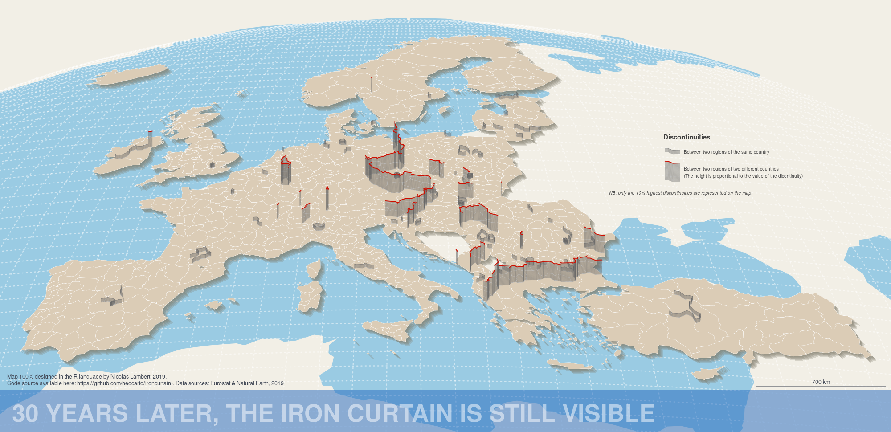

```{r setup, include=FALSE}

## Global options
knitr::opts_chunk$set(echo=TRUE,
        	            cache=FALSE,
                      prompt=FALSE,
                      comment=NA,
                      message=FALSE,
                      warning=FALSE,
                      class.source="bg-info",
                      class.output="bg-warning")
```

# Introduction {-}


Ce document montre comment réaliser cette carte de discontuités en 2,5D (fausse 3D) joliement mise en page entrièrement dans le langage R. Des versions antérieures de cette carte ont déjà été publiées par le passé, dans le manuel de cartographie [@lambert2016manuel], ou dans Mad Maps [@lambert2019mad] et ont fait l'objet de billets de blog [@lambert2019mise]. Ici, nous entendons prouver qu'il est possible de réaliser ce type de carte sans passer par un logiciel DAO [@lambert2019dessiner]. Les sources et les références sont précisées à la fin du document.

# Préparation des données

## Packages

Pour réaliser cette carte, nous nous nous appuyons sur 4 packagee : le package  *sf* [@sf] pour gérer les objets spatiaux,  le package *mapsf* [@mapsf] pour l'affichage des différentes couches composant la carte, le package *eurostat* [@eurostat] pour les données et le package *RnaturalEarth* [@rnaturalearth] pour quelques couches d'habillages supplémentaires. 

```{r, eval = TRUE, message = FALSE, warning = FALSE}
library("sf")
library("mapsf")
library("eurostat")
library("rnaturalearth")
```

## Données géométriques

Avec le package *Eurostat*, nous créons d'un fond de carte hybride avec maillage homogène nuts2/3. Tous les pays sont au niveau nuts3 version 2016 sauf l'Autriche, la Belgique, la Suisse, l'Allemagne, la Grèce, les Pays-Bas, la Turquie, l'Irlande, l'Islande et la Norvège. Pour des raisons de disponibilité des données post Brexit, Le Royaume-Uni est au niveau nuts2 vesrion 2013. 

```{r, eval = TRUE, message = FALSE, warning = FALSE}
nuts2016 <- get_eurostat_geospatial(
  output_class = "sf",
  resolution = "20",
  nuts_level = "all",
  year = "2016"
)

nuts2016_3 <- nuts2016[nuts2016$LEVL_CODE == 3, ]
nuts2016_2 <- nuts2016[nuts2016$LEVL_CODE == 2, ]

N2 <-
  c("AT", "BE", "CH", "DE", "EL", "NL", "UK", "TR", "IE", "IS", "NO")
nuts <- rbind(nuts2016_2[nuts2016_2$CNTR_CODE %in% N2, ],
              nuts2016_3[!nuts2016_3$CNTR_CODE %in% N2, ])

nuts <- nuts[nuts$CNTR_CODE != "UK", ]

nuts <- nuts[,c("id","NUTS_NAME","geometry")]
colnames(nuts) <- c("id","name","geometry")

nuts2013 <- get_eurostat_geospatial(
  output_class = "sf",
  resolution = "20",
  nuts_level = "2",
  year = "2013"
)

uk = nuts2013[nuts2013$CNTR_CODE == "UK",c("id","NUTS_NAME","geometry")]
colnames(uk) <- c("id","name","geometry")

nuts <- rbind(nuts, uk)


nuts <-
  nuts[!nuts$id %in% c("FRY10", "FRY20", "FRY30", "FRY40", "FRY50"), ]
nuts <- nuts[nuts$id != "RS", ]
```

```{r, eval = TRUE, echo = FALSE, message = FALSE, warning = FALSE, fig.height = 3}
par(mar = c(0, 0, 0, 0), mfrow = c(1, 3))
mf_map(nuts, col = "#CCCCCC", border = NA)
mf_map(nuts[substr(nuts$id,1,2) %in%  c("AT", "BE", "CH", "DE", "EL", "NL", "TR", "IE", "IS", "NO"),],
       col = "#6eb1db",
       border = "white",
       lwd = 0.2, add = TRUE)
mf_title("NUTS 2 (version 2016)", bg = "#6eb1db")
mf_map(nuts, col = "#CCCCCC", border = NA)
mf_map(nuts[!substr(nuts$id,1,2) %in%  c("AT", "BE", "CH", "DE", "EL", "NL", "UK", "TR", "IE", "IS", "NO", "UK"),],
       col = "#6eb1db",
       border = "white",
       lwd = 0.2, add = TRUE)
mf_title("NUTS 3 (version 2016)", bg = "#6eb1db")
mf_map(nuts, col = "#CCCCCC", border = NA)
mf_map(nuts[substr(nuts$id,1,2) == "UK",],
       col = "#6eb1db",
       border = "white",
       lwd = 0.2, add = TRUE)
mf_title("NUTS 2 (version 2013)", bg = "#6eb1db")
```

## Données statistiques

Grace au package *eurostat*, nous récupérons les données de PIB par habitant en 2016.

```{r, eval = TRUE, message = FALSE, warning = FALSE}
var <- "nama_10r_3gdp"
gdpinh <- get_eurostat(var, time_format = "num")
gdpinh <- subset(gdpinh, gdpinh$unit == "EUR_HAB")
gdpinh <- gdpinh[gdpinh$time == 2016,c("geo","values")]
colnames(gdpinh) <- c("id","GDPINH_2016")
```

A Cause du Brexit, les données pour le Royaume-Uni ne sont plus disponibles. Les données sont également manquantes pour quelques unités territoriales. Nous combinons donc les données issues d'Eurostat avec des estimations issues de la [base de données ESPON](https://database.espon.eu/). Celles-si ont été préalablement stockées dans dans le fichier local *missing.csv*. NOus combinons les 2 jeux de données pour avoir une couverture exhaustive de l'espace à représenter,

```{r, eval = TRUE, message = FALSE, warning = FALSE}
missing <- read.csv("data/missing.csv")
gdpinh = rbind(gdpinh, missing)
```

Pour des questions de reproductibilité, nous sauvegardons les données ainsi complétées dans le répertoire local data.

```{r, eval = TRUE, message = FALSE, warning = FALSE}
write.csv(gdpinh, "data/gdpinh.csv")
```

Nous effectuons une Jointure entre les données et les géométries.

```{r, eval = TRUE, message = FALSE, warning = FALSE}
nuts <- merge(
  x = nuts,
  y = gdpinh,
  by = "id",
  all.x = TRUE
)
```

## Couches d'habillage

Pour compléter la carte, nous importons des couches d'habillage avec le package *RnaturalEarth*.

```{r, eval = TRUE, message = FALSE, warning = FALSE, results = "hide"}
land <- ne_download(
  scale = 110,
  type = "land",
  category = "physical",
  returnclass = "sf"
)
```

```{r, eval = TRUE, message = FALSE, warning = FALSE}
mf_map(land, border = NA, col = "#6eb1db")
```

```{r, eval = TRUE, message = FALSE, warning = FALSE, results = "hide"}
ocean <- ne_download(
  scale = 110,
  type = "ocean",
  category = "physical",
  returnclass = "sf"
)
```

```{r, eval = TRUE, message = FALSE, warning = FALSE}
mf_map(ocean, border = NA, col = "#6eb1db")
```

Puis, nous créons une couche de graticules avec le package *sf*.

```{r, eval = TRUE, message = FALSE, warning = FALSE, results = "hide"}
graticule = st_graticule(
  crs = st_crs(4326),
  ndiscr = 100,
  lon = seq(-180, 180, by = 2),
  lat = seq(-90, 90, by = 1),
  margin = 0.01
)
```

```{r, eval = TRUE, message = FALSE, warning = FALSE}
mf_map(graticule, col = "#6eb1db")
```

## Template cartographique

Pour donner un effet de rotondité et permettre une représentation en 2.5D, on opte pour une projection orthographique centré sur l'Afrique. Pour éviter tout problème dans l'opération de projection (bug, artefacts, etc.), nous définissons au préalable un rectangle nous servant à découper les différentes couches. Pour que cette opération se passe bien, nous devons passer le paramètre *sf_use_s2* à *FALSE* pour faire comme si les latitudes et longitudes étaient des coordonnées euclidienne. Une fois les intersections effectuées, nous repassons ce paramètre à *TRUE*.

```{r, eval = TRUE, message = FALSE, warning = FALSE, results = "hide"}
bb <-
  st_as_sfc(st_bbox(c(
    xmin = -50 ,
    xmax = 70,
    ymin = 20,
    ymax = 80
  ),
  crs = st_crs(4326)))

sf::sf_use_s2(FALSE)
ocean <- st_intersection(ocean, bb)
ocean <-  st_segmentize(ocean, 100)
land <- st_intersection(land, bb)
land <-  st_segmentize(land, 100)
graticule <- st_intersection(graticule, bb)
sf::sf_use_s2(TRUE)
```

Nous projetons les différentes couches dans une projection orthographique centrée sur l'Afrique (10° de latitude nord et 15° de longitude). 

```{r, eval = TRUE, message = FALSE, warning = FALSE, results = "hide"}
ortho <- "+proj=ortho +lat_0=-10 +lon_0=15 +x_0=0 +y_0=0
          +ellps=WGS84 +units=m +no_defs"

ocean <- st_transform(ocean, ortho)
land <- st_transform(land, ortho)
graticule =  st_transform(graticule, ortho)
nuts <- st_transform(nuts, ortho)
```

Affichons les couches recadrées et projetées.

```{r, eval = TRUE, message = FALSE, warning = FALSE}
par(mar = c(0, 0, 0, 0), mfrow = c(2, 2))
mf_map(land, col = "#6eb1db", border = NA)
mf_title("land", bg = "#6eb1db")
mf_map(ocean, col = "#6eb1db", border = NA)
mf_title("ocean", bg = "#6eb1db")
mf_map(graticule, col = "#6eb1db", lwd = 1)
mf_title("graticule", bg = "#6eb1db")
mf_map(nuts,
       col = "#6eb1db",
       border = "white",
       lwd = 0.2)
mf_title("nuts", bg = "#6eb1db")
dev.off()
```

On peut générer un effet d'ombrage en unissant les régions nuts et en effectuant des déplacements successifs avec de la transparence. Voir l'exemple ci-dessous sur la France.

```{r, eval = TRUE, message = FALSE, warning = FALSE}
fr <- st_union(nuts[substr(nuts$id, 1, 2) == "FR", ])
par(mar = c(0, 0, 0, 0))
mf_map(fr + c(5000,-5000), col = "#827e6c40", border = NA)
mf_map(fr + c(10000,-10000),
       col = "#827e6c40",
       border = NA,
       add = TRUE)
mf_map(fr + c(15000,-15000),
       col = "#827e6c40",
       border = NA,
       add = TRUE)
mf_map(fr + c(20000,-20000),
       col = "#827e6c40",
       border = NA,
       add = TRUE)
mf_map(fr + c(25000,-25000),
       col = "#827e6c40",
       border = NA,
       add = TRUE)
mf_map(
  fr,
  col = "#6eb1db",
  border = "white",
  lwd = 0.1,
  add = TRUE
)
```

## Template

Nous réalisons à présent un Template cartographique. Pour cela, nous définissons précisément l'emprise de la carte dans le système de coordonnées de la projection. Les coordonnées étant en mètres, nous utilisons un facteur 100 000 (variable k) qui nous permet de manipuler des chiffres plus petits avec un niveau de précision satisfaisant. Nous utiliserons également ce facteur k pour positionner les différents éléments d'habillage de la carte. 

```{r, eval = TRUE, message = FALSE, warning = FALSE}
k <- 100000
extent <- c(-20, 42, 24.5, 63) * k
bb <- st_as_sfc(st_bbox(
  c(
    xmin = extent[1],
    xmax = extent[3],
    ymin = extent[2],
    ymax = extent[4]
  ),
  crs = st_crs(nuts)
))
```

On crée une fonction template().

```{r, eval = TRUE, message = FALSE, warning = FALSE}
template = function(file) {
  theme <- mf_theme(
    x = "default",
    bg = "#f2efe6",
    fg = "#f2efe6",
    mar = c(0, 0, 0, 0),
    tab = TRUE,
    pos = "left",
    inner = FALSE,
    line = 2,
    cex = 1.9,
    font = 3
  )
  
  mf_export(
    bb,
    export = "png",
    width = 2000,
    filename = file,
    res = 150,
    theme = theme,
    expandBB = c(-.02, 0, 0.05, 0)
  )
  
  mf_map(
    ocean,
    col = "#9acbe3",
    border = "#9acbe3",
    lwd = 5,
    add = TRUE
  )
  
  mf_map(
    graticule,
    col = "#FFFFFF80",
    lwd = 1.5,
    lty = 3,
    add = TRUE
  )
  
  
  ue <- st_union(nuts)
  
  mf_map(ue + c(5000,-5000),
         col = "#827e6c40",
         border = NA,
         add = TRUE)
  mf_map(ue + c(10000,-10000),
         col = "#827e6c40",
         border = NA,
         add = TRUE)
  mf_map(ue + c(15000,-15000),
         col = "#827e6c40",
         border = NA,
         add = TRUE)
  mf_map(ue + c(20000,-20000),
         col = "#827e6c40",
         border = NA,
         add = TRUE)
  mf_map(ue + c(25000,-25000),
         col = "#827e6c40",
         border = NA,
         add = TRUE)
  
  mf_map(
    nuts,
    col = "#dbccb6",
    border = "white",
    lwd = 0.3,
    add = TRUE
  )
  rect(-22 * k,
       41.3 * k,
       28 * k,
       41.3 * k + 250000,
       border = NA,
       col = "#2369bd80")
  text(
    x = -21.5 * k,
    y = 42.4 * k,
    "30 YEARS LATER, THE IRON CURTAIN IS STILL VISIBLE",
    cex = 2.14,
    pos = 4,
    font = 2,
    col = "#FFFFFF80"
  )
  text(
    x = -21.75 * k,
    y = 44.25 * k,
"Map 100% designed in the R language by Nicolas Lambert, 2019. 
Code source available here: https://github.com/neocarto/ironcurtain). Data sources: Eurostat & Natural Earth, 2019",
    cex = 0.5,
    pos = 4,
    font = 1,
    col = "#3f4654"
  )
  
  mf_scale(
    size = 700,
    lwd = 0.6,
    cex = 0.5,
    col = "#3f4654",
    pos = c(19 * k, y = 44 * k)
    )
}
```

Et voilà le résultat :-)

```{r, eval = TRUE, message = FALSE, warning = FALSE, results = "hide"}
template("figures/fig1.png")
dev.off()
```


# Carte choroplèthe

## Choix des classes et des couleurs

```{r, eval = TRUE, message = FALSE, warning = FALSE}
# Discrétisation
bks <-
  mf_get_breaks(x = nuts$GDPINH_2016,
                nbreaks = 6,
                breaks = "quantile")
# Couleurs
cols <-
  c("#50b160",
    "#98c17e",
    "#cce3c4",
    "#fbf5bd",
    "#fcc34f",
    "#e97d40")
```

## Réalisation de la carte

```{r, eval = TRUE, message = FALSE, warning = FALSE, results = "hide"}
template("figures/fig2.png")

mf_map(
  x = nuts,
  var = "GDPINH_2016",
  type = "choro",
  breaks = bks,
  pal = cols,
  lwd = 0.2,
  leg_pos = "n",
  add = TRUE
)

mf_legend(
  type = "choro",
  pos = c(11 * k, 59.05 * k),
  title = "",
  val = bks,
  val_cex = 0.4,
  pal = cols,
  fg = "#333333",
  cex = 0.85,
  border = "red",
  val_rnd = 0,
  no_data = FALSE,
  frame = FALSE
)

text(
  10.5 * k,
  y = 59.1 * k,
  "Gross Domestic Product",
  cex = 0.75,
  pos = 4,
  font = 2,
  col = "#404040"
)
text(
  10.5 * k,
  y = 58.7 * k,
  "(in € per inh. in 2016)",
  cex = 0.55,
  pos = 4,
  font = 1,
  col = "#404040"
)
dev.off()
```


# Discontinuités

Pour générer les frontières entre les régions nuts, nous calculons une petite zone tampon (pour éliminer les éventuelles erreurs toplogiques) et effectuons une intersection entre tous les polygones. Nous definissons les géométries de sortie comme MULTILINESTRING. 

```{r, eval = TRUE, message = FALSE, warning = FALSE}
nuts.borders  <- st_intersection(st_buffer(nuts, 5), st_buffer(nuts, 5)) 
nuts.borders  <- st_cast(nuts.borders ,"MULTILINESTRING")
nuts.borders  <- nuts.borders [nuts.borders $id != nuts.borders $id.1, ] 
nuts.borders$id1 = nuts.borders$id
nuts.borders$id2 = nuts.borders$id.1
nuts.borders$id =  paste0(nuts.borders$id1, "_", nuts.borders$id2)
rownames(nuts.borders) = nuts.borders$id
nuts.borders  = nuts.borders [,c("id","id1","id2","geometry")]
```

Puis, nous effectuons une double jointure pour relier à chaque frontière les données de PIB par habitant des regions NUTS de part et d’autre.

```{r, eval = TRUE, message = FALSE, warning = FALSE}
vals <- nuts[,c("id","GDPINH_2016")] %>% st_set_geometry(NULL)
nuts.borders <- merge (x = nuts.borders, y = vals,
                       by.x = "id1", by.y = "id", all.x = T)
nuts.borders <- merge (x = nuts.borders, y = vals,
                       by.x = "id2", by.y = "id", all.x = T)
```

Nous calculons pour chaque frontière une valeur de discontinuité. Ici, discontinuités relatives.

```{r, eval = TRUE, message = FALSE, warning = FALSE}
nuts.borders$disc <- nuts.borders$GDPINH_2016.x / nuts.borders$GDPINH_2016.y
```


Nous choisissons de ne conserver que les 10% discontinuités les plus fortes. Cela revient à choisir comme seuil la valeur 0.95 car il y a deux valeurs par frontières (A/B et B/A).

```{r, eval = TRUE, message = FALSE, warning = FALSE}
threshold <- 0.95
disc <- nuts.borders[nuts.borders$disc >= quantile(nuts.borders$disc,threshold),]
```

On affiche les discontinuités dans le template cartographique.

```{r, eval = TRUE, message = FALSE, warning = FALSE, results = "hide"}
template("figures/fig3.png")
mf_map(
  x = disc,
  col = "#d92e94",
  lwd = 3,
  add = TRUE
)
dev.off()
```


On constate que les fortes discontinuités entre les régions européennes suivent très largement le tracé de l’ancien rideau de fer (si on fait abstraction de ancienne frontière RFA/RDA). C’est cela que nous souhaitons mettre en valeur par un procédé d'extrusion pour rappeler la symbolique du mur.

# Extrusion

Pour extruder les lignes, nous procedons de la même façon que pour l’effet d’ombrage. Nous translatons les lignes plusieurs fois en Y (vers le haut). Sur la projection orthographique utilisée, cela produit un effet 3D. Le nombre d’itérations et l’éccart entre les lignes détermine la hauteur du mur. Voici un exemple.

```{r, eval = TRUE, message = FALSE, warning = FALSE}
# On séléctionne une ligne au hasard
line <- st_geometry(disc[5, ])

# nombre d'itérations
nb <- 15

# valeur de translation
delta <- 200

# On effectue une boucle
par(mar = c(0, 0, 0, 0), bg = "#f2efe6")
mf_map(line, col = "#66666690", lwd = 0.5)
for (j in 1:nb) {
  line <- line + c(0, delta)
  mf_map(line,
         col = "#66666690",
         lwd = 0.5 ,
         add = TRUE)
}

# On affiche la derinière ligne en rouge avec une épaisseur de 1.2
mf_map(line,
       col = "#cf0e00",
       lwd = 1.2,
       add = TRUE)
```

Pour faire en sorte que l’effet 3D fonctionne bien, nous décomposons les lignes et les ordonnons en fonction de leur valeur en Y (pour faire en sorte que les lignes qui sont devant apparaissent devant)

```{r, eval = TRUE, message = FALSE, warning = FALSE}
disc <- st_cast(disc,"LINESTRING")
c <- as.data.frame(st_coordinates(st_centroid(disc)))
disc$Y <- c$Y
disc <- disc[order(disc$Y, decreasing = TRUE), ]
```

Car nous considerons que les frontières nationales renvoient à des disparités historiques plus dures, nous choisissons de traiter différement les discontinuités entre deux régions d’un même pays et les discontinuités entre deux régions de deux pays différents. Les premières auront une hauteur de mur constante (8 itérations). Les secondes auront une hauteur de mur qui dépendra de la valeur des discontinuités (entre 30 et 100 itérations) et seront représentées en rouges.

```{r, eval = TRUE, message = FALSE, warning = FALSE}
disc$c1 <- substr(disc$id1,1,2)
disc$c2 <- substr(disc$id2,1,2)


# Discontinuities between two regions of two different countries
disc$height <- round(scales::rescale(disc$disc, to=c(30,70)),0)
disc$col <-"#cf0e00"
disc$thickness <- 1.2

# Discontinuities between two regions of the same country
for (i in 1:length(disc$disc)){ if (disc$c1[i]== disc$c2[i]) {
  disc$height[i] <- 8  
  disc$col[i] <-"#66666690"
  disc$thickness[i] <- 0.5
  }
}
```

On fabrique une fonction pour extruder.

```{r, eval = TRUE, message = FALSE, warning = FALSE}
delta <- 2500 # spacing between lines (walls) 
extrude <- function(id){
  line <- st_geometry(disc[id,])
  mf_map(line, col= "#66666690",lwd = 0.5 ,add= TRUE)
      nb <- as.numeric(disc[id,"height"])[1]
      for (j in 1:nb){
        line <- st_geometry(line) + c(0,delta)
        mf_map(st_geometry(line), col= "#66666690",lwd = 0.5 ,add= TRUE)  
      }
      mf_map(line, col= disc$col[id],lwd = disc$thickness[id] ,add= TRUE)
}
```

On applique la fonction à toutes les lignes de la façon suivante

```{r, eval = TRUE, message = FALSE, warning = FALSE, results = "hide"}
template("figures/fig4.png")

for (i in 1:length(disc$height))
{
  extrude(i)
}

# Habillage
d = 0.75 * k
text(14.4*k - d, y = 57.4*k, "Discontinuities", cex = 0.6,
     pos = 4, font = 2, col="#404040")     
text(15.5*k - d, y = 56.6*k, "Between two regions of the same country",
     cex = 0.4, pos = 4, font = 1, col="#404040")   
text(15.5*k - d, y = 55.7*k, "Between two regions of two different countries",
     cex = 0.4, pos = 4, font = 1, col="#404040")   
text(15.5*k - d, y = 55.3*k,
     "(The height is proportional to the value of the dicontinuity)",
     cex = 0.4, pos = 4, font = 1, col="#404040")   
text(10.7*k, y = 54.4*k,
     "NB: only the 10% highest discontinuities are represented on the map.",
     cex = 0.4, pos = 4, font = 3, col="#404040")   

# Lignes

myline <- disc[disc$id == "TR21_BG341",]
st_geometry(myline) <- st_geometry(myline) + c(4.2*k, 5*k)
myline2 <- myline
st_geometry(myline2) <- st_geometry(myline2) + c(0, 1.5*k)

# discontinuités entre deux régions de deux pays différentes
  
  plot(myline, col= "#66666690",lwd = 0.5 ,add= T)
  for (i in 1:40){
    myline <- st_geometry(myline) + c(0,delta)
    plot(st_geometry(myline), col= "#66666690",lwd = 0.5 ,add= T)  
  }
  plot(myline, col= "#cf0e00",lwd = 1.2 ,add= T)

# discontinuités entre deux régions d'un même pays

  plot(myline2, col= "#66666690",lwd = 0.5 ,add= T)
  for (i in 1:8){
    myline2 <- st_geometry(myline2) + c(0,delta)
    plot(st_geometry(myline2), col= "#66666690",lwd = 0.5 ,add= T)  
  }
  plot(myline2, col= "#66666690",lwd = 0.5 ,add= T)
dev.off()
```



# Carte finale

```{r, eval = TRUE, message = FALSE, warning = FALSE, results = "hide"}
template("figures/ironcurtain.png")

mf_map(
  x = nuts,
  var = "GDPINH_2016",
  type = "choro",
  breaks = bks,
  pal = cols,
  lwd = 0.2,
  leg_pos = "n",
  add = TRUE
)

mf_legend(
  type = "choro",
  pos = c(11 * k, 59.05 * k),
  title = "",
  val = bks,
  val_cex = 0.4,
  pal = cols,
  fg = "#333333",
  cex = 0.85,
  border = "red",
  val_rnd = 0,
  no_data = FALSE,
  frame = FALSE
)

text(
  10.5 * k,
  y = 59.1 * k,
  "Gross Domestic Product",
  cex = 0.75,
  pos = 4,
  font = 2,
  col = "#404040"
)
text(
  10.5 * k,
  y = 58.7 * k,
  "(in € per inh. in 2016)",
  cex = 0.55,
  pos = 4,
  font = 1,
  col = "#404040"
)

for (i in 1:length(disc$height))
{
  extrude(i)
}

# Habillage
d = 0.75 * k
text(14.4*k - d, y = 57.4*k, "Discontinuities", cex = 0.6,
     pos = 4, font = 2, col="#404040")     
text(15.5*k - d, y = 56.6*k, "Between two regions of the same country",
     cex = 0.4, pos = 4, font = 1, col="#404040")   
text(15.5*k - d, y = 55.7*k, "Between two regions of two different countries",
     cex = 0.4, pos = 4, font = 1, col="#404040")   
text(15.5*k - d, y = 55.3*k,
     "(The height is proportional to the value of the dicontinuity)",
     cex = 0.4, pos = 4, font = 1, col="#404040")   
text(10.7*k, y = 54.4*k,
     "NB: only the 10% highest discontinuities are represented on the map.",
     cex = 0.4, pos = 4, font = 3, col="#404040")   

# Lignes

myline <- disc[disc$id == "TR21_BG341",]
st_geometry(myline) <- st_geometry(myline) + c(4.2*k, 5*k)
myline2 <- myline
st_geometry(myline2) <- st_geometry(myline2) + c(0, 1.5*k)

# discontinuités entre deux régions de deux pays différentes
  
  plot(myline, col= "#66666690",lwd = 0.5 ,add= T)
  for (i in 1:40){
    myline <- st_geometry(myline) + c(0,delta)
    plot(st_geometry(myline), col= "#66666690",lwd = 0.5 ,add= T)  
  }
  plot(myline, col= "#cf0e00",lwd = 1.2 ,add= T)

# discontinuités entre deux régions d'un même pays

  plot(myline2, col= "#66666690",lwd = 0.5 ,add= T)
  for (i in 1:8){
    myline2 <- st_geometry(myline2) + c(0,delta)
    plot(st_geometry(myline2), col= "#66666690",lwd = 0.5 ,add= T)  
  }
  plot(myline2, col= "#66666690",lwd = 0.5 ,add= T)
dev.off()
```


Et voilà. Même si cela nécessite quelques tâtonnements pour positionner les différents éléments, nous venons de faire la démonstration qu'il est donc possible de faire de la cartographie d'édition, stylisée et mise en page, uniquement avec R :-)

# Bibliographie {-}

<div id="refs"></div>


# Annexes {-}


## Info session  {-}

```{r session_info, echo=FALSE}
kableExtra::kable_styling(knitr::kable(rzine::sessionRzine()[[1]], row.names = F))
kableExtra::kable_styling(knitr::kable(rzine::sessionRzine()[[2]], row.names = F))
```


## Citation {-}

```{r ReadCitation, echo=FALSE}
citationRzine <- bibtex::read.bib("cite.bib")
``` 

`r capture.output(print(citationRzine[1]))`

### Format BibTex : {-}

```{r generateBibTex, echo=FALSE}
cat(readLines('cite.bib'), sep = '\n')
``` 

<br/>


## Glossaire {- #endnotes}

```{js, echo=FALSE}

$(document).ready(function() {
  $('.footnotes ol').appendTo('#endnotes');
  $('.footnotes').remove();
});

```
