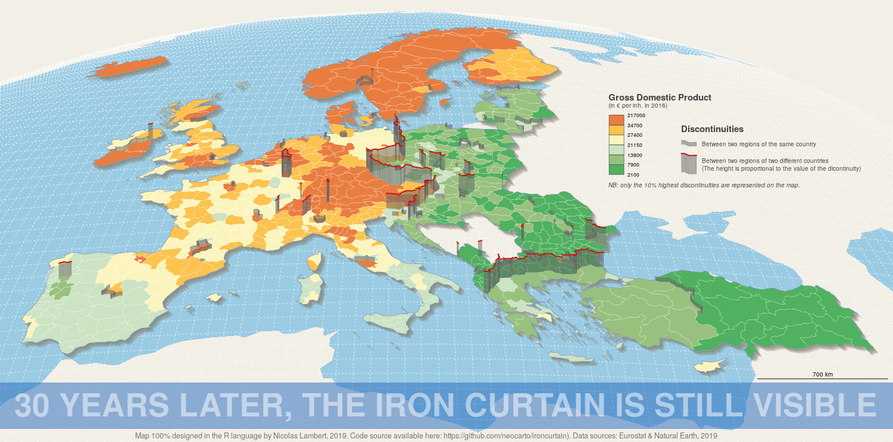
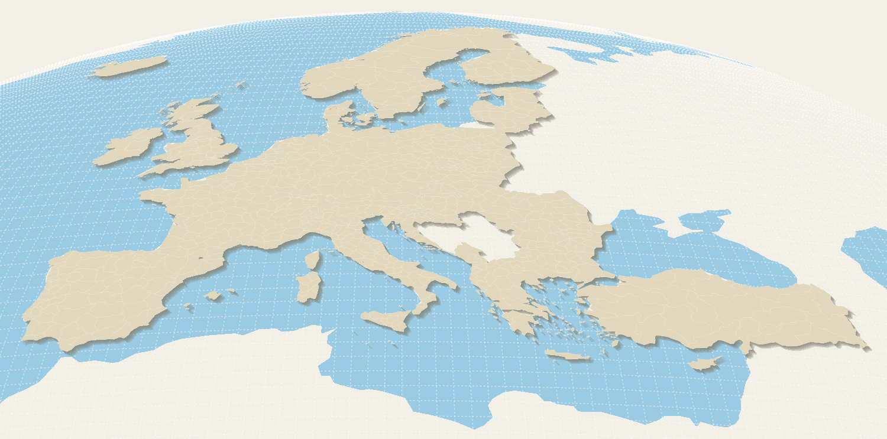
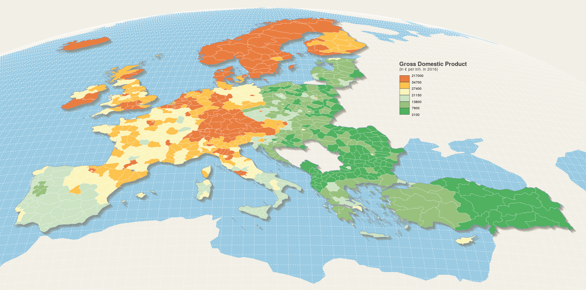
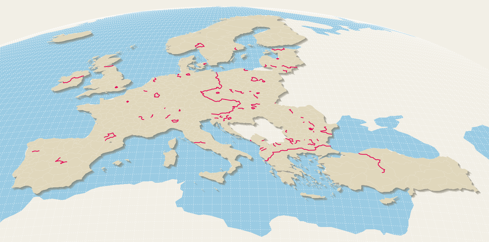
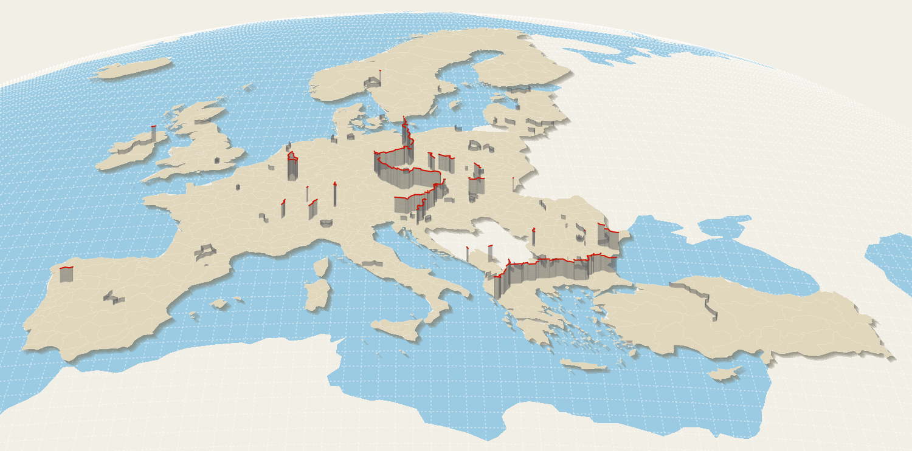
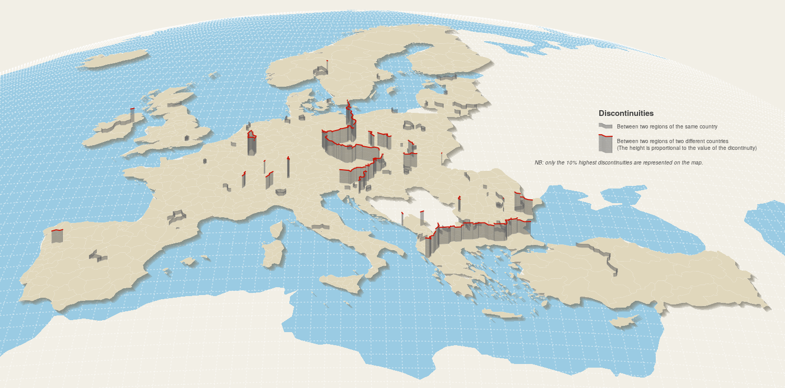

Ce document montre comment réaliser cette carte de discontuités en 2,5D joliement mise en page entrièrement dans le langage R. Nous utilisons les packages *eurostat*, *RnaturalEarth*, *sf* et *cartography*.




## Packages

```{r, eval = TRUE, message = FALSE, warning = FALSE}
library("sf")
library("cartography")
library("eurostat")
library("rnaturalearth")
```


## Données

Import des données et du fond de carte avec le package *Eurostat*

Import des géometries (NUTS version 2016).

```{r, eval = TRUE, message = FALSE, warning = FALSE}
nuts2016 <- get_eurostat_geospatial(output_class = "sf",
                                    resolution = "20",
                                    nuts_level = "all",
                                    year = "2016")
```

Import des données statistiques (PIB par habitant en euros) pour les années récentes

```{r, eval = TRUE, message = FALSE, warning = FALSE}
var <- "nama_10r_3gdp"
gdpinh <- get_eurostat(var, time_format = "num")
gdpinh <- subset(gdpinh, gdpinh$unit == "EUR_HAB")
gdpinh <- reshape2::dcast(gdpinh, geo ~ time, value.var = "values")
fields <- c("geo", "2014", "2015", "2016", "2017")
gdpinh <- gdpinh[,fields]
colnames(gdpinh) <- c("id","GDPINH_2014","GDPINH_2015","GDPINH_2016", "GDPINH_2017")
```

Jointure des données et du fond de carte pour les niveaux nuts 2 et nuts 3 

```{r, eval = TRUE, message = FALSE, warning = FALSE}
nuts2016 <- merge(x = nuts2016, y = gdpinh, 
                  by.x = "NUTS_ID", by.y = "id", all.x=T)
nuts2016_3 <- nuts2016[nuts2016$LEVL_CODE == 3,]
nuts2016_2 <- nuts2016[nuts2016$LEVL_CODE == 2,]
```

Création d'un fond de carte combinant les NUTS 2 et le NUTS 3 dans le but d'avoir un maillage homogène avec le mois possible de données manquantes.

```{r, eval = TRUE, message = FALSE, warning = FALSE}
N2 <- c("AT", "BE", "CH", "DE", "EL", "NL", "UK", "TR", "IE", "IS", "NO")
nuts <- rbind(nuts2016_2[nuts2016_2$CNTR_CODE %in% N2,],
              nuts2016_3[!nuts2016_3$CNTR_CODE %in% N2,])
nuts$id <- nuts$NUTS_ID
```

Emilination des territoires hors espace d'étude

```{r, eval = TRUE, message = FALSE, warning = FALSE}
nuts <- nuts[! nuts$id %in% c("FRY10", "FRY20", "FRY30", "FRY40", "FRY50"),]
nuts <- nuts[nuts$CNTR_CODE != "RS",]
```

Visulisation du fond de carte non projeté (en wgs84)

```{r, eval = TRUE, message = FALSE, warning = FALSE}
par(mar = c(0,0,0,0), bg="#f2efe6")
typoLayer(x = nuts, var="LEVL_CODE",  
          col = c("#cc5e4e", "#76c24f"),
          legend.values.order = c("2","3"),
          border= "#e8e8e8", lwd=0.2,
          legend.pos = "left",
          legend.title.txt = "Nuts level (version 2016)")
```

Détermination de l'année cible
```{r, eval = TRUE, message = FALSE, warning = FALSE}
sapply(nuts[,c("GDPINH_2014","GDPINH_2015","GDPINH_2016", "GDPINH_2017")],
             function(x) sum(is.na(x)))
```

On cible l'année 2016 qui est la plus récente et qui a le moins de données manquantes

```{r, eval = TRUE, message = FALSE, warning = FALSE}
nuts <- nuts[,c("id","NUTS_NAME","GDPINH_2016","geometry")]
colnames(nuts) <- c("id","name","GDPINH_2016","geometry")
```

On complète les données manquantes par de données estimées en externe.

```{r, eval = TRUE, message = FALSE, warning = FALSE}
nuts[nuts$id == "CH01","GDPINH_2016"] <- 44418.07
nuts[nuts$id == "CH02","GDPINH_2016"] <- 38721.88
nuts[nuts$id == "CH03","GDPINH_2016"] <- 51173.14
nuts[nuts$id == "CH04","GDPINH_2016"] <- 56462.12
nuts[nuts$id == "CH05","GDPINH_2016"] <- 40871.44
nuts[nuts$id == "CH06","GDPINH_2016"] <- 43665
nuts[nuts$id == "CH07","GDPINH_2016"] <- 35029.52
nuts[nuts$id == "LI000","GDPINH_2016"] <- 160000
nuts[nuts$id == "IS00","GDPINH_2016"] <- 55900
```

Import des couches d'habillage avec le package *RnaturalEarth*

```{r, eval = TRUE, message = FALSE, warning = FALSE}
ocean <- ne_download(scale = 110, type = "ocean",
                     category = "physical", returnclass = "sf")
par(mar = c(0,0,0,0), bg="#f2efe6")
plot(st_geometry(ocean), border=NA, col="#7bc7e3")
```

```{r, eval = TRUE, message = FALSE, warning = FALSE}
graticule <- ne_download(scale = 50, type = "graticules_1",
                         category = "physical", returnclass = "sf")
par(mar = c(0,0,0,0), bg="#f2efe6")
plot(st_geometry(graticule), col = "#820311", lwd = 0.1)
```


## Template cartographique

Pour donner un effet de rotondité et permettre une représentation en 2.5D, on opte pour une projection orthographique centré sur l'Afrique.

```{r, eval = TRUE, message = FALSE, warning = FALSE}
ortho <- "+proj=ortho +lat_0=-10 +lon_0=15 +x_0=0 +y_0=0
          +ellps=WGS84 +units=m +no_defs"
```

Pour éviter tout problème dans l'opération de projection (bug, artefacts, etc.), nous definissons au préalable un rectangle nous servant à découper les diférentes couches avant projection. Puis, la projection se déroule sans accrocs.

```{r, eval = TRUE, message = FALSE, warning = FALSE}
bb <- st_as_sfc(st_bbox(c(xmin = -50 , xmax = 70, ymin = 20, ymax = 80),
                        crs = st_crs(4326)))
graticule <- st_transform(st_intersection(x = graticule, y = bb), ortho)
ocean <- st_transform(st_buffer(st_intersection(x = ocean, y = bb),0.1), ortho)
nuts <- st_transform(nuts,ortho)

# Affichage
par(mar = c(0,0,0,0), bg="#f2efe6", mfrow=c(3,1))
plot(st_geometry(graticule), col = "#820311", lwd = 0.1)
plot(st_geometry(ocean), col = "#7bc7e3", border = NA)
plot(st_geometry(nuts), col= "#ff7700", border="white", lwd = 0.1)
```

On peut générer un effet d'ombrage en unissant les régions nuts et en effectuant des déplacements successifs avec de la transparence.

```{r, eval = TRUE, message = FALSE, warning = FALSE}
fr <- st_union(nuts[substr(nuts$id,1,2) == "FR",])
par(mar = c(0,0,0,0), bg="#f2efe6")
plot(st_geometry(fr) + c(5000, -5000), col ="#827e6c40", border = NA)
plot(st_geometry(fr) + c(10000, -10000), col ="#827e6c40", border = NA, add = T)
plot(st_geometry(fr) + c(15000, -15000), col ="#827e6c40", border = NA, add = T)
plot(st_geometry(fr) + c(20000, -20000), col ="#827e6c40", border = NA, add = T)
plot(st_geometry(fr) + c(25000, -25000), col ="#827e6c40", border = NA, add = T)
plot(st_geometry(fr), col= "#e0d7bc", border="white", lwd = 0.1, add=T)
```

Réalisation du template cartographique. POur bien maitriser le format de l'image, nous utilisons la fonction *getFigDim* et nous générons la carte au format png.

```{r, eval = TRUE, message = FALSE, warning = FALSE}
# Définition de l'emprise précise de la carte
k <- 100000
extent <- c(-20, 42, 24.5, 63) * k
bb <- st_as_sfc(st_bbox(c(xmin = extent[1] , xmax = extent[3],
                          ymin = extent[2], ymax = extent[4]),crs = st_crs(nuts)))
sizes <- getFigDim(x = bb, width = 1500,mar = c(0,0,1.2,0), res = 150)

# Construction de l'image
eu <- st_union(nuts)
png("img/fig1.png", width = sizes[1], height = sizes[2], res = 150)
par(mar = c(0,0,0,0), bg="#f2efe6")
plot(st_geometry(ocean), col="#9acbe3", border = NA,
     xlim = extent[c(1,3)], ylim = extent[c(2,4)])
plot(st_geometry(graticule), col= "#FFFFFF80",  lty=3, add=T)
plot(st_geometry(eu) + c(5000, -5000), col ="#827e6c40", border = NA, add = T)
plot(st_geometry(eu) + c(10000, -10000), col ="#827e6c40", border = NA, add = T)
plot(st_geometry(eu) + c(15000, -15000), col ="#827e6c40", border = NA, add = T)
plot(st_geometry(eu) + c(20000, -20000), col ="#827e6c40", border = NA, add = T)
plot(st_geometry(eu) + c(25000, -25000), col ="#827e6c40", border = NA, add = T)
plot(st_geometry(nuts), col= "#e0d7bc", border="white", lwd = 0.1, add=T)
dev.off()
```



## Carte choroplèthe

Réalisation de la carte choroplèthe sur le PIB par habitant en 2016. Nous choisissons une discretisation en 6 classes selon la méthodes des quantiles et une palette de couleures divergentes issue de ColorBrewer. La legende est générée à part pour bien la positionner sur la carte.

```{r, eval = FALSE, message = FALSE, warning = FALSE}
# Discrétisation
bks <- getBreaks(nuts$GDPINH_2016,nclass=6,method = "quantile")

# Couleurs
cols <- c("#50b160", "#98c17e", "#cce3c4", "#fbf5bd", "#fcc34f", "#e97d40")

# Couche Choroplèthe
choroLayer(x = nuts, var = "GDPINH_2016",
           breaks = bks, col = cols,
           border = "white", lwd=0.2,
           legend.pos = NA, add=T)

# Légende
text(10.5*k, y = 59.1*k, "Gross Domestic Product",
     cex = 0.6, pos = 4, font = 2, col="#404040")     
text(10.5*k, y = 58.7*k, "(in € per inh. in 2016)",
     cex = 0.4, pos = 4, font = 1, col="#404040")    
legendChoro(pos = c(11*k,55*k), title.txt = "",
            values.cex = 0.35, breaks = bks, col = cols, cex = 0.5,
            values.rnd = 2, nodata = FALSE, frame = FALSE, symbol = "box",
            border = "#404040", horiz = FALSE)

dev.off()
```




## Discontinuités

Pour générer lignes de discontinuités nous utilisons la fonction *getBorders*.

```{r, eval = TRUE, message = FALSE, warning = FALSE}
nuts.borders <- getBorders(nuts)
```

Puis, nous effectuons une double jointure pour relier à chaque frontière les données de PIB par habitant des regions NUTS de part et d'autre. Notons que cette opération aurait pu être efectuée directement avec la fonction *discLayer* du package *cartography*.

```{r, eval = TRUE, message = FALSE, warning = FALSE}
vals <- nuts[,c("id","GDPINH_2016")] %>% st_set_geometry(NULL)
nuts.borders <- merge (x = nuts.borders, y = vals,
                       by.x = "id1", by.y = "id", all.x = T)
nuts.borders <- merge (x = nuts.borders, y = vals,
                       by.x = "id2", by.y = "id", all.x = T)
```

Nous calculons pour chaque frontière une valeur de discontinuité. Ici, discontinuités relatives.

```{r, eval = TRUE, message = FALSE, warning = FALSE}
nuts.borders$disc <- nuts.borders$GDPINH_2016.x / nuts.borders$GDPINH_2016.y
```

Nous choisissons de ne conserver que les 10% discontinuités les plus fortes. Cela revient à choisir comme seuil la valeur 0.95 car il y a deux valeurs par frontières (A/B et B/A).

```{r, eval = TRUE, message = FALSE, warning = FALSE}
threshold <- 0.95
disc <- nuts.borders[nuts.borders$disc >= quantile(nuts.borders$disc,threshold),]
```

On affiche les discontinuités dans le template cartographique



On constate que les fortes discontinuités entre les régions européennes suivent très largement le tracé de l'ancien rideau de fer (si on fait abstraction de l'ancienne frontière RFA/RDA). C'est cela que nous souhaitons mettre en valeur par un procédé d'extrusion pour rappeler la symbolique du mur.

## Extrusion

Pour extruder les lignes, nous procedons de la même façon que pour l'effet d'ombrage. Nous translation les lignes plusieurs fois en Y vers le haut. Sur la projection orthographique utilisée, cela produit un effet 3D. Le nombre d'itérations et l'éccart entre les lignes détermine la hauteur du mur. Voici un exemple.

```{r, eval = TRUE, message = FALSE, warning = FALSE}
# On séléctionne une ligne au hasard
line <- st_geometry(disc[2,])

# nombre d'itérations
nb <- 15

# valeur de translation
delta <- 200

# On effectue une boucle
par(mar = c(0,0,0,0), bg="#f2efe6")
plot(line, col= "#66666690",lwd = 0.5)
for (j in 1:nb){
        line <- line + c(0,delta)
        plot(line, col= "#66666690",lwd = 0.5 ,add= T)  
}

# On affiche la derinière ligne en rouge avec une épaisseur de 1.2
plot(line, col= "#cf0e00",lwd = 1.2, add=T)
```

Pour faire en sorte que l'effet 3D fonctionne bien, nous décompsons les lignes et les ordonnons en fonction de leur valeur en Y (pour faire en sorte que les lignes qui sont devant apparaissent devant)

```{r, eval = TRUE, message = FALSE, warning = FALSE}
disc <- st_cast(disc,"LINESTRING")
c <- as.data.frame(st_coordinates(st_centroid(disc)))
disc$Y <- c$Y
disc <- disc[order(disc$Y, decreasing = TRUE), ]
```

Car nous considerons que les frontières nationales renvoient à des disparités historiques plus dures, nous choisissons de traiter différement les discontinuités entre deux régions d'un même pays et les discontinuités entre deux régions de deux pays différents. Les premières auront une hauteur de mur constante (8 itérations). Les secondes auront une hauteur de mur qui dépendra de la valeur des discontinuités (entre 30 et 100 itérations) et seront représentées en rouges.

```{r, eval = TRUE, message = FALSE, warning = FALSE}
disc$c1 <- substr(disc$id1,1,2)
disc$c2 <- substr(disc$id2,1,2)


# Discontinuities between two regions of two different countries
disc$height <- round(scales::rescale(disc$disc, to=c(30,70)),0)
disc$col <-"#cf0e00"
disc$thickness <- 1.2

# Discontinuities between two regions of the same country
for (i in 1:length(disc$disc)){ if (disc$c1[i]== disc$c2[i]) {
  disc$height[i] <- 8  
  disc$col[i] <-"#66666690"
  disc$thickness[i] <- 0.5
  }
}
```

On fabrique une fonction pour extruder (à améliorer)

```{r, eval = TRUE, message = FALSE, warning = FALSE}
delta <- 2500 # spacing between lines (walls) 
extrude <- function(id){
  line <- st_geometry(disc[id,])
  plot(line, col= "#66666690",lwd = 0.5 ,add= T)
      nb <- as.numeric(disc[id,"height"])[1]
      for (j in 1:nb){
        line <- st_geometry(line) + c(0,delta)
        plot(st_geometry(line), col= "#66666690",lwd = 0.5 ,add= T)  
      }
      plot(line, col= disc$col[id],lwd = disc$thickness[id] ,add= T)
}
```

On applique la fonction à toutes les lignes de la façon suivante
```{r, eval = FALSE, message = FALSE, warning = FALSE}
for (i in 1:length(disc$height))
{
  extrude(i)
}
dev.off()
```


L'affichage de la légende s'effectue avec quelque tatonements en translatant une ligne au hasard, en l'extrudant et en positionnement judicieusement les textes. 

```{r, eval = FALSE, message = FALSE, warning = FALSE}
# Textes

text(14.4*k, y = 57.4*k, "Discontinuities", cex = 0.6,
     pos = 4, font = 2, col="#404040")     
text(15.5*k, y = 56.6*k, "Between two regions of the same country",
     cex = 0.4, pos = 4, font = 1, col="#404040")   
text(15.5*k, y = 55.7*k, "Between two regions of two different countries",
     cex = 0.4, pos = 4, font = 1, col="#404040")   
text(15.5*k, y = 55.3*k,
     "(The height is proportional to the value of the dicontinuity)",
     cex = 0.4, pos = 4, font = 1, col="#404040")   
text(10.5*k, y = 54.4*k,
     "NB: only the 10% highest discontinuities are represented on the map.",
     cex = 0.4, pos = 4, font = 3, col="#404040")   

# Lignes

myline <- disc[disc$id == "TR21_BG341",]
st_geometry(myline) <- st_geometry(myline) + c(5*k, 5*k)
myline2 <- myline
st_geometry(myline2) <- st_geometry(myline2) + c(0, 1.5*k)

# discontinuités entre deux régions de deux pays différentes
  
  plot(myline, col= "#66666690",lwd = 0.5 ,add= T)
  for (i in 1:40){
    myline <- st_geometry(myline) + c(0,delta)
    plot(st_geometry(myline), col= "#66666690",lwd = 0.5 ,add= T)  
  }
  plot(myline, col= "#cf0e00",lwd = 1.2 ,add= T)

# discontinuités entre deux régions d'un même pays

  plot(myline2, col= "#66666690",lwd = 0.5 ,add= T)
  for (i in 1:8){
    myline2 <- st_geometry(myline2) + c(0,delta)
    plot(st_geometry(myline2), col= "#66666690",lwd = 0.5 ,add= T)  
  }
  plot(myline2, col= "#66666690",lwd = 0.5 ,add= T)
```



# Carte finale

Pour réaliser la carte dans son ensemble, vous pouvez copier coller le code ci-dessous : 


## 1) Import et mise en forme des données

```{r, eval = FALSE, message = FALSE, warning = FALSE}
library("sf")
library("rnaturalearth")
library("cartography")
library("eurostat")
library("reshape2") 

# ----------------------------------------------------
# STEP 1: BUILDING A NUTS 2/3 LAYER WITH GDP PER INH.
# ----------------------------------------------------

# GEOMETRIES

nuts2016 <- get_eurostat_geospatial(output_class = "sf", resolution = "20", nuts_level = "all", year = "2016")

# GDP PER INH

var <- "nama_10r_3gdp"
gdpinh <- get_eurostat(var, time_format = "num")
gdpinh <- subset(gdpinh, gdpinh$unit == "EUR_HAB")
gdpinh <- dcast(gdpinh, geo ~ time, value.var = "values")
fields <- c("geo", "2014", "2015", "2016", "2017")
gdpinh <- gdpinh[,fields]
colnames(gdpinh) <- c("id","GDPINH_2014","GDPINH_2015","GDPINH_2016", "GDPINH_2017")

# JOIN

nuts2016 <- merge(x = nuts2016, y = gdpinh, by.x = "NUTS_ID", by.y = "id", all.x=T) # gdpinh
nuts2016_3 <- nuts2016[nuts2016$LEVL_CODE == 3,]
nuts2016_2 <- nuts2016[nuts2016$LEVL_CODE == 2,]

# NUTS 2/3 LAYER

N2 <- c("AT", "BE", "CH", "DE", "EL", "NL", "UK", "TR", "IE", "IS", "NO")
nuts <- rbind(nuts2016_2[nuts2016_2$CNTR_CODE %in% N2,],  nuts2016_3[!nuts2016_3$CNTR_CODE %in% N2,])
nuts$id <- nuts$NUTS_ID
nuts <- nuts[! nuts$id %in% c("FRY10", "FRY20", "FRY30", "FRY40", "FRY50"),]
nuts <- nuts[nuts$CNTR_CODE != "RS",]

nuts <- nuts[,c("id","NUTS_NAME","GDPINH_2016","geometry")]
colnames(nuts) <- c("id","name","GDPINH_2016","geometry")

# MISSING DATA

var <- "GDPINH_2016"
plot(st_geometry(nuts), col="#CCCCCC", border="white", lwd=0.2)
plot(st_geometry(nuts[is.na(nuts[,var]),]), col="red", border="white",lwd = 0.2, add=T)

gdpinh[gdpinh$id == "IS","GDPINH_2016"]
gdpinh[gdpinh$id == "CH","GDPINH_2016"]
gdpinh[gdpinh$id == "LI","GDPINH_2016"]

missing <- data.frame(nuts[is.na(nuts$GDPINH_2016),c("id","name")])

CH_N0 <- 72300 ; IS_N0 <- 55900 ; LI_N0 <- 160000 ; CH01 <- 44418.07031 ; CH02 <- 38721.87891 ; CH03 <- 51173.14453 ; CH04 <- 56462.11719 ; CH05 <- 40871.4375 ; CH06 <- 43665.00391 ; CH07 <- 35029.51953 ; refval <- 45146.8046875
CH01_ratio <- CH01 / refval ; CH02_ratio <- CH02 / refval ; CH03_ratio <- CH03 / refval ; CH04_ratio <- CH04 / refval ; CH05_ratio <- CH05 / refval ; CH06_ratio <- CH06 / refval ; CH07_ratio <- CH07 / refval ; CH01 <- CH01_ratio * CH_N0 ; CH02 <- CH02_ratio * CH_N0 ; CH03 <- CH03_ratio * CH_N0 ; CH04 <- CH04_ratio * CH_N0 ; CH05 <- CH05_ratio * CH_N0 ; CH06 <- CH06_ratio * CH_N0 ; CH07 <- CH07_ratio * CH_N0

nuts[nuts$id == "CH01","GDPINH_2016"] <- CH01
nuts[nuts$id == "CH02","GDPINH_2016"] <- CH02
nuts[nuts$id == "CH03","GDPINH_2016"] <- CH03
nuts[nuts$id == "CH04","GDPINH_2016"] <- CH04
nuts[nuts$id == "CH05","GDPINH_2016"] <- CH05
nuts[nuts$id == "CH06","GDPINH_2016"] <- CH06
nuts[nuts$id == "CH07","GDPINH_2016"] <- CH07
nuts[nuts$id == "LI000","GDPINH_2016"] <- LI_N0
nuts[nuts$id == "IS00","GDPINH_2016"] <- IS_N0

# -----------------------------------
# STEP 2: MAP DESIGN
# -----------------------------------

# IMPORT LAYERS FROM NATURALEARTH

graticule <- ne_download(scale = 50, type = "graticules_1", category = "physical", returnclass = "sf")
ocean <- ne_download(scale = 110, type = "ocean", category = "physical", returnclass = "sf")

# ORTHOGRAPHIC PROJECTION

ortho <- "+proj=ortho +lat_0=-10 +lon_0=15 +x_0=0 +y_0=0 +ellps=WGS84 +units=m +no_defs"
bb <- st_as_sfc(st_bbox(c(xmin = -50 , xmax = 70, ymin = 20, ymax = 80),crs = st_crs(4326)))

graticule <- st_transform(st_intersection(x = graticule, y = bb), ortho)
ocean <- st_transform(st_buffer(st_intersection(x = ocean, y = bb),0.1), ortho)
nuts <- st_transform(nuts,ortho)
nuts.borders <- getBorders(nuts)
eu <- st_union(nuts)
```

## 2) Cartographie

```{r, eval = TRUE, message = FALSE, warning = FALSE}
png("img/ironcurtain.png", width = sizes[1], height = sizes[2], res = 150)
par(mar = c(0,0,0,0), bg="#f2efe6")
plot(st_geometry(ocean), col="#9acbe3", border = NA, xlim = extent[c(1,3)], ylim = extent[c(2,4)])
plot(st_geometry(graticule), col= "#FFFFFF80",  lty=3, add=T)
plot(st_geometry(eu) + c(5000, -5000), col ="#827e6c40", border = NA, add = T)
plot(st_geometry(eu) + c(10000, -10000), col ="#827e6c40", border = NA, add = T)
plot(st_geometry(eu) + c(15000, -15000), col ="#827e6c40", border = NA, add = T)
plot(st_geometry(eu) + c(20000, -20000), col ="#827e6c40", border = NA, add = T)
plot(st_geometry(eu) + c(25000, -25000), col ="#827e6c40", border = NA, add = T)
plot(st_geometry(nuts), col= "#e0d7bc", border="white", lwd = 0.1, add=T)

bks <- getBreaks(nuts$GDPINH_2016,nclass=6,method = "quantile")
cols <- c("#50b160", "#98c17e", "#cce3c4", "#fbf5bd", "#fcc34f", "#e97d40")
choroLayer(x = nuts, var = "GDPINH_2016",
           breaks = bks, col = cols,
           border = "white", lwd=0.2,
           legend.pos = NA, add=T)
plot(st_geometry(eu), col= NA, border="#718eb0", lwd = 0.5, add=T)

# DISCONTINUITIES

threshold <- 0.95 # 0.95 = The highest 10% discontinuities (because two values by border)
delta <- 2500 # spacing between lines (walls) 

vals <- nuts[,c("id","GDPINH_2016")] %>% st_set_geometry(NULL)
nuts.borders <- merge (x = nuts.borders, y = vals, by.x = "id1", by.y = "id", all.x = T)
nuts.borders <- merge (x = nuts.borders, y = vals, by.x = "id2", by.y = "id", all.x = T)
nuts.borders$disc <- nuts.borders$GDPINH_2016.x / nuts.borders$GDPINH_2016.y
disc <- nuts.borders[nuts.borders$disc >= quantile(nuts.borders$disc,threshold),]

disc$c1 <- substr(disc$id1,1,2)
disc$c2 <- substr(disc$id2,1,2)

disc <- st_cast(disc,"LINESTRING")
c <- as.data.frame(st_coordinates(st_centroid(disc)))
disc$Y <- c$Y
disc <- disc[order(disc$Y, decreasing = TRUE), ]

# Discontinuities between two regions of two different countries
disc$height <- round(scales::rescale(disc$disc, to=c(30,70)),0)
disc$col <-"#cf0e00"
disc$thickness <- 1.2

# Discontinuities between two regions of the same country
for (i in 1:length(disc$disc)){ if (disc$c1[i]== disc$c2[i]) {
  disc$height[i] <- 8  
  disc$col[i] <-"#66666690"
  disc$thickness[i] <- 0.5
  }
}


# 2.5D EFFECT

extrude <- function(id){
  line <- st_geometry(disc[id,])
  plot(line, col= "#66666690",lwd = 0.5 ,add= T)
      nb <- as.numeric(disc[id,"height"])[1]
      for (j in 1:nb){
        line <- st_geometry(line) + c(0,delta)
        plot(st_geometry(line), col= "#66666690",lwd = 0.5 ,add= T)  
      }
      plot(line, col= disc$col[id],lwd = disc$thickness[id] ,add= T)
}

for (i in 1:length(disc$height))
{
  extrude(i)
}


# TEXTS AND LEGENDS

rect(-22*k, 41.3*k, 28*k, 41.3*k+250000, border = NA, col = "#2369bd80")
text(-21.5*k, y = 42.4*k, "30 YEARS LATER, THE IRON CURTAIN IS STILL VISIBLE", cex = 2.14, pos = 4, font = 2, col="#FFFFFF80")     
text(-15*k, y = 40.9*k, "Map 100% designed in the R language by Nicolas Lambert, 2019. Code source available here: https://github.com/neocarto/ironcurtain). Data sources: Eurostat & Natural Earth, 2019", cex = 0.5, pos = 4, font = 1, col="#806e6c")     

text(10.5*k, y = 59.1*k, "Gross Domestic Product", cex = 0.6, pos = 4, font = 2, col="#404040")     
text(10.5*k, y = 58.7*k, "(in € per inh. in 2016)", cex = 0.4, pos = 4, font = 1, col="#404040")    
legendChoro(pos = c(11*k,55*k), title.txt = "",
            values.cex = 0.35, breaks = bks, col = cols, cex = 0.5,
            values.rnd = 2, nodata = FALSE, frame = FALSE, symbol = "box",
            border = "#404040", horiz = FALSE)


text(14.4*k, y = 57.4*k, "Discontinuities", cex = 0.6, pos = 4, font = 2, col="#404040")     
text(15.5*k, y = 56.6*k, "Between two regions of the same country", cex = 0.4, pos = 4, font = 1, col="#404040")   
text(15.5*k, y = 55.7*k, "Between two regions of two different countries", cex = 0.4, pos = 4, font = 1, col="#404040")   
text(15.5*k, y = 55.3*k, "(The height is proportional to the value of the dicontinuity)", cex = 0.4, pos = 4, font = 1, col="#404040")   
text(10.5*k, y = 54.4*k, "NB: only the 10% highest discontinuities are represented on the map.", cex = 0.4, pos = 4, font = 3, col="#404040")   

myline <- disc[disc$id == "TR21_BG341",]
st_geometry(myline) <- st_geometry(myline) + c(5*k, 5*k)
myline2 <- myline
st_geometry(myline2) <- st_geometry(myline2) + c(0, 1.5*k)

  plot(myline, col= "#66666690",lwd = 0.5 ,add= T)
  for (i in 1:40){
    myline <- st_geometry(myline) + c(0,delta)
    plot(st_geometry(myline), col= "#66666690",lwd = 0.5 ,add= T)  
  }
  plot(myline, col= "#cf0e00",lwd = 1.2 ,add= T)

  plot(myline2, col= "#66666690",lwd = 0.5 ,add= T)
  for (i in 1:8){
    myline2 <- st_geometry(myline2) + c(0,delta)
    plot(st_geometry(myline2), col= "#66666690",lwd = 0.5 ,add= T)  
  }
  plot(myline2, col= "#66666690",lwd = 0.5 ,add= T)
  
  barscale(700, lwd = 0.6, cex = 0.4, pos = c(19*k, y = 44*k),style = "pretty")
  
dev.off()

```


